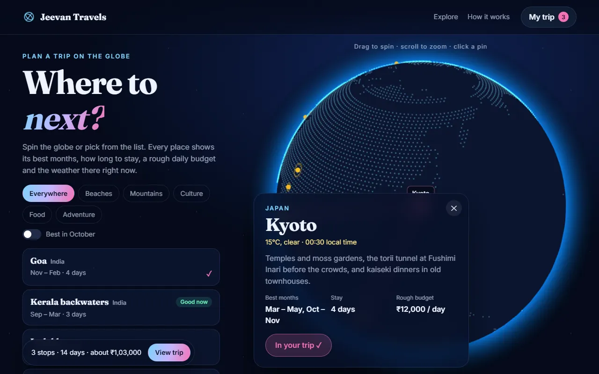

# Jeevan Travels

Plan a trip on a 3D globe. Spin it, pick places, see their best months and the weather there right now, and build a route that draws itself across the world with days, distance and a rough budget added up as you go.

**Live:** https://travel-website-ashen-seven.vercel.app



## Features

- **A globe made of dots.** About 7,500 points mark the continents, generated ahead of time from Natural Earth's public-domain land outlines, with a glowing atmosphere around them. Drag to spin, scroll or pinch to zoom; it turns slowly on its own when left alone.
- **Pins for 15 destinations**, from Goa and Ladakh to Kyoto and Iceland, each pulsing gently. Click a pin or a name in the list and the camera flies round to it, with a label that follows the pin.
- **Details** for each place: a short description, best months (ranges that wrap the new year, like "Nov – Feb"), how long to stay, a rough daily budget, and live temperature, conditions and local time from Open-Meteo.
- **Filters** by beaches, mountains, culture, food or adventure, and a switch for places that are in season this month.
- **Trip builder.** Add stops and arcs draw themselves between them on the globe, with a light running along each one. Reorder or remove stops; days, kilometres between stops and a rough budget update as you go. The trip is saved in your browser and in the address bar, so **Copy share link** gives someone else the same route.
- Keyboard friendly, labelled controls, and `prefers-reduced-motion` respected. Without WebGL the list, details and trip still work.

## What changed from the first version

The first version was a static travel-agency template with fake login and sign-up forms that asked for passwords and sent them nowhere, placeholder reviews, and about 52 MB of background videos. Those are gone. The page is now an actual tool, and everything you see is drawn in code or comes from open data.

## How it works

Plain HTML, CSS and ES modules, with no build step. Three.js comes from jsDelivr through an import map.

| File | Job |
|---|---|
| `src/globe.js` | The Three.js globe: land dots, atmosphere shader, pins, picking, camera flights, trip arcs |
| `src/trip.js` | Pure logic: great-circle distance, trip totals, share links, month ranges, decoding the land dots |
| `src/data.js` | The destinations |
| `src/land-dots.js` | Generated by `scripts/make-land-dots.mjs` from Natural Earth |
| `src/main.js` | List, filters, details with live weather, trip drawer, pin label |

## Run it

Serve the folder with any static server, for example:

```bash
npx serve .
```

Tests use Node's built-in runner (Node 20+):

```bash
npm test
```

## Credits

Land outlines from [Natural Earth](https://www.naturalearthdata.com/) (public domain) via [world-atlas](https://github.com/topojson/world-atlas). Weather from [Open-Meteo](https://open-meteo.com/) (CC BY 4.0). Budgets are rough guides per person per day, excluding flights.
